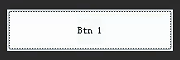
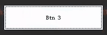

# PyQt_Widges

## swipeAction
|                right                |               left                |
|:-----------------------------------:|:---------------------------------:|
|   |  |

- ScrollArea 的平滑滚动参考：https://www.cnblogs.com/zhiyiYo/p/17066835.html
- Button 的点击事件与 ScrollArea 的鼠标滑动（press + move + release）的冲突通过事件过滤器解决。

# commitCalendar

- 参考：https://blog.csdn.net/qq_25000387/article/details/104523756
- 在基础上新增了星期和月份的表示。
- 因为是绘制的，后续考虑将其中的方块换成 QLabel，或者是其他组件，更容易拓展功能。